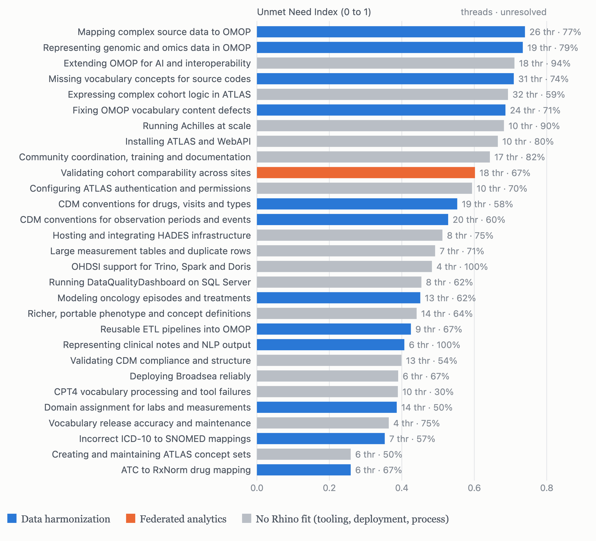
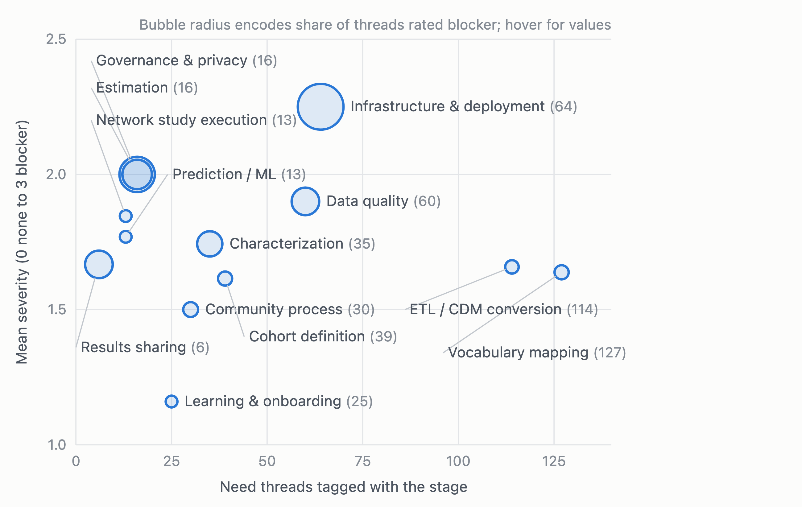

# OHDSI Community Signals

What two years of public OHDSI Forums threads say about the community's technology needs.
Every topic posted to [forums.ohdsi.org](https://forums.ohdsi.org) between 1 October 2024 and
1 October 2026 (776 topics, 2,164 posts) was collected, pseudonymized, coded for the technical
problem behind it, and clustered into a ranked taxonomy of 29 needs.

- **Blog post** (HTML, with figures): `report/blog/ohdsi-community-signals.html`
- **Full report**: [`report/REPORT.md`](report/REPORT.md)
- **Analysis plan and execution record**: [`ANALYSIS_PLAN.md`](ANALYSIS_PLAN.md)
- **Deliverables** (coded dataset, needs taxonomy, tables, Word draft): [`deliverables/`](deliverables/)

## Headline findings



*Twenty-nine bottom-up need clusters ranked by Unmet Need Index. Blue: data harmonization
(12 clusters, 194 pain points). Orange: federated analytics (1 cluster, 18). Grey: tool bugs,
installation, authentication, performance and community process (16 clusters, 177).*

- **Harmonization dominates.** Vocabulary mapping and ETL/CDM conversion account for 43% of
  need statements. The failures are specific: combination drugs that lose dose when mapped to
  RxNorm ingredients, missing ICD-O-3 and TNM oncology concepts, no production pattern for
  genomic data, ambiguous lab domains, and ICD-10 to SNOMED mappings that fall outside the
  hierarchy and silently drop patients from cohorts (one thread: 897 patients; another: 21,667).
- **Platform problems carry the highest severity.** A third of infrastructure threads were
  blockers: Atlas/WebAPI installation, LDAP and Active Directory authentication, Achilles and
  DataQualityDashboard on large databases, missing back-end support (Trino, Spark, Doris).
- **Multi-site threads ask for comparability, not execution.** 46 threads (11%) involved more
  than one site. They ask how to detect when sites encode the same concept differently, how to
  validate two independently converted OMOP datasets against each other, how to stratify results
  by site, and how to share model outputs without patient-level data. Federated learning does
  not appear as a request.



*Thirteen OHDSI lifecycle stages by number of need threads (horizontal) and mean severity
(vertical; 0 none to 3 blocker). Bubble radius encodes the share of threads rated blocking.*

## Limitations

The forum is the public, implementer-heavy slice of OHDSI. Much workgroup and network-study
discussion happens in Microsoft Teams, which is not public and was not available. Platform and
harmonization needs are therefore probably over-weighted relative to analysis and execution
needs, and reply rates on the forum are not interpreted. See the report for the full list.

## Method in one paragraph

Threads were collected through the Discourse JSON API at one request per 1.6 seconds
(`collect/forums.py`), normalized and pseudonymized with salted hashes, emails and @-mentions
scrubbed (`process/build_tables.py`). Each thread was coded against a fixed schema
(`model/coding_schema.md`) covering post type, lifecycle stage, tools, pain point,
job-to-be-done, severity, workaround, resolution, multi-site and harmonization context, and a
verbatim evidence quote. An 80-thread sample was independently re-coded; Cohen's kappa was 0.90
for pain-point presence, 0.77 harmonization context, 0.70 post type, 0.60 severity and 0.36
resolution status, so resolution was anchored on reply metadata. The 392 pain-point sentences
were embedded (bge-small-en-v1.5) and clustered (Ward, k=30; `model/need_clusters.py`), then
labeled and mapped to capability areas with written rationales. The Unmet Need Index
(`model/unmet_index.py`) is a weighted rank of volume (0.35), unresolved share (0.25), mean
severity (0.20), positive trend (0.10) and unresolved volume (0.10); all components are published.

## Reproducing

```bash
python3.11 -m venv .venv && .venv/bin/pip install -r requirements.txt
python3 collect/forums.py                                  # paced crawl -> data/raw/forums/
.venv/bin/python process/build_tables.py                   # -> data/processed/threads.parquet, posts.parquet
.venv/bin/python model/prepare_batches.py --batch-size 45  # -> data/processed/coding_batches/
# code each batch with an LLM using model/coding_prompt.md + model/coding_schema.md
#   -> data/processed/coding_out/batch_XXXX.jsonl
.venv/bin/python model/merge_coding.py                     # -> threads_coded.parquet / .csv
.venv/bin/python model/need_clusters.py --n-clusters 30    # -> need_clusters.parquet, need_clusters_summary.json
# label clusters with an LLM using model/label_clusters_prompt.md -> need_cluster_labels.jsonl
.venv/bin/python model/topics.py --source forums --substantive-only
.venv/bin/python model/unmet_index.py --topics data/processed/topics_forums_subst/doc_topics.parquet \
    --need-clusters data/processed/need_clusters.parquet
.venv/bin/python model/reliability.py                      # after re-coding the sample
.venv/bin/python report/blog/build_post.py                 # -> report/blog/ohdsi-community-signals.html
```

Raw forum text, processed tables and the pseudonymization salt are excluded from version control
(`data/` is gitignored). The collector reproduces them from the public API.

## Repository layout

| Path | Contents |
|---|---|
| `collect/` | Paced, resumable forum collector |
| `process/` | Normalization and pseudonymization |
| `model/` | Coding schema and prompts, batch preparation, merge, clustering, topic model, scoring, reliability |
| `report/` | Report, blog post and figure generator, Word-document build |
| `deliverables/` | `threads_coded.csv` (one row per thread, pseudonymized), `needs_taxonomy.csv`, metrics, report tables, coding agreement, Word draft |
| `data/out_of_scope/` | (local only) GitHub issues pull, excluded after a pilot |

## AI use and provenance

Analysis date: 4 October 2026. The pipeline was written and run with Claude Code using Claude
Fable 5.1 as the orchestrating model. Threads were coded by Claude Haiku 4.5; the reliability
sample was re-coded by Claude Sonnet 5.5; need clusters were labeled and mapped by Claude Opus
5.5 and reviewed by the author. The report and blog post were drafted by Claude Fable 5.1 from
the resulting tables and edited by the author. Every quantitative claim traces to a table in
`deliverables/`.

## Quotes and contact

Quotes in the report and post are reproduced verbatim, shortened to under 25 words, and
unattributed. The forum is public, but its members did not post for a study; if a quote is yours
and you would prefer it removed, open an issue.

Author: Daniel Feller, Rhino Federated Computing.
